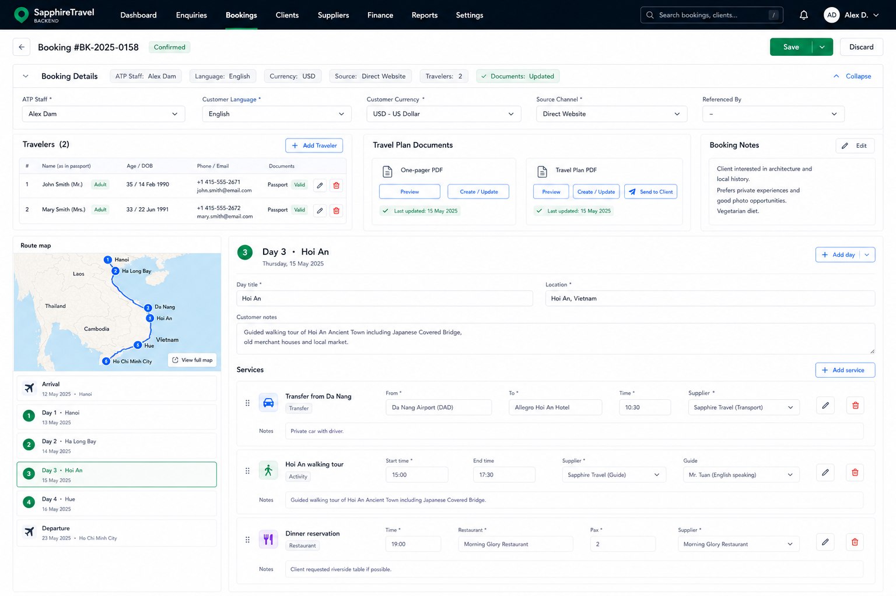

# New Booking Page

This document describes the proposed backend booking workspace shown in the latest mockup.

## Goal

The booking page becomes a staff workspace for editing the customer booking and the detailed travel plan in one place. The primary working area is the travel plan builder, while booking metadata, traveler details, notes, and PDF actions remain close by in collapsible sections.

The redesign is also a cleanup of the booking model surface. Fields that are now derived from the travel plan should no longer be stored separately on the booking.

## Page Structure

The page sits below the backend navigation and keeps the normal save flow available. Unsaved edits should still be visible through the booking dirty bar, and the page should continue to prevent risky persisted actions while local edits are pending.

The upper booking information block is collapsible. In its compact state it should summarize the booking without taking much vertical space. In the expanded state it contains the operational booking fields and supporting customer information:

- ATP staff assignment.
- Customer language.
- Customer currency.
- Source channel.
- Referenced by, including the conditional detail field when the referral type needs one.
- Traveler list with key details and document status.
- Travel plan document actions for the one-pager PDF and the travel plan PDF.
- Booking notes.

The booking ID, copy action, and last-updated text stay visible. The booking hero photo is removed entirely from the model, API, frontend code, and UI.

Destinations are removed from the booking model, API, frontend code, and UI. The travel plan also no longer stores or edits `travel_plan.destination_scope`. All booking locations and destination summaries are derived from the primary location selected on each day.

The previously proposed client/trip/date/pax/agent strip and the top-right import or route buttons are not part of this concept.

## Original Request

The current web-form submission table becomes a collapsible section named "Original request". It preserves the submitted customer request as read-only reference data, including contact details, travel timing, traveler count, duration range, budget, submitted notes, source URL, referrer, UTM fields, and submitted timestamp.

This section is informational. Staff should not edit the original request from this page.

## Travel Plan Builder

The travel plan builder is the dominant section of the page. It is laid out as a three-column workspace:

- Left: a map at the top, followed by a non-draggable itinerary selector.
- Center: the editor for the currently selected item only.
- Right: supporting itinerary context and actions, without a separate service inspector.

The itinerary selector under the map contains arrival at the top, then the trip days, then departure at the bottom. The day entries are selection controls, not drag handles. Reordering, if supported later, should be a deliberate action rather than an accidental drag gesture in this row.

When staff select arrival, a day, or departure, the large center editor switches to that item only. This keeps the main editing surface focused and avoids mixing multiple days in one editing form.

Experience highlights remain editable per booking day. Editing an experience highlight in `booking.html` does not change the corresponding marketing-tour day.

## Day Editing

Day cards in the editor are significantly larger than the current compact rows. A selected day should expose:

- Day title, date, location, and internal/customer notes.
- A service list for that day.
- Inline controls to add, remove, and edit services.
- Service details such as time, service type, location, supplier or partner, short customer-facing description, internal notes, attachments, and status where needed.

The service list belongs inside the selected day editor. The separate service inspector from the earlier concept is removed.

Creating a new empty day remains available. Appending or copying an existing day is handled by the customizer, not by a separate "append existing day" action in the booking page.

Services are fully editable inside the booking: staff can add a new service, change the text, and upload or replace the picture. These edited services are stored with the booking and are not shared back to other bookings.

## Arrival And Departure

Arrival and departure use the same focused editor pattern as normal days, but their fields should be tailored to transfer and logistics work. Typical fields include flight or transport details, pickup/drop-off locations, timing, greeting notes, and special handling requirements.

Arrival always appears above the days and departure always appears below the days in the UI. Each item can still display "None" when no arrival or departure details apply.

## Traveler And Document Area

The expanded booking details area shows a traveler table for quick scanning. Full traveler editing can remain a modal or open as an inline detail panel, but the summary needs to show enough information for staff to identify missing data:

- Traveler name and role.
- Age or date of birth.
- Phone and email.
- Passport or ID status.
- Quick edit action.

Food preferences, allergies, room preferences, roles, consents, passport or ID images, address, internal traveler notes, and traveler detail links remain in the traveler modal rather than the summary table.

The document area groups the one-pager PDF and travel plan PDF. The new document cards must keep the current document-management behavior: existing PDF rows with page count, date, comments, sent-to-customer toggle, delete action, attachments, and personalization fields.

## Financial Aspects

A new collapsible "Financial aspects" section contains the current commercial workspace: offer detail level, offer pricing, quotation summary, payment plan, payment request PDFs, payment confirmation PDFs, and payment/receipt status. It appears below the travel-plan builder.

When staff expand "Financial aspects", the travel-plan builder automatically collapses so the commercial workflow does not compete with the itinerary editor for vertical space.

The financial section should preserve current permission checks, dirty-state rules, document generation requirements, and payment flow behavior.

## Model And API Cleanup

The booking hero photo is removed from persistent booking data, upload/update APIs, frontend state, and UI controls.

Booking-level destinations are removed from persistent booking data, update APIs, frontend state, and UI controls.

`travel_plan.destination_scope` is removed from persistent travel-plan data, update APIs, frontend state, and UI controls. Any destination or location summary shown in the booking page is derived from the primary location of each travel-plan day.

Booking-local travel-plan services remain embedded in the booking travel plan. Editing a service in one booking must not mutate a shared service catalog or another booking.

## Design Notes

The page should prioritize dense operational work over a marketing-style layout. The map and selected-day editor should feel like the core tool, while the collapsible booking details section prevents secondary information from pushing the itinerary editor too far down the page.

The layout should preserve current booking permissions, dirty-state handling, localization, and backend save behavior. Any redesign should map cleanly to the existing booking API model instead of adding purely visual state that cannot be saved.
