# JSON to PostgreSQL Migration Plan

## Purpose

This document defines the transition from file-based operational storage in `backend/app/data/store.json` to PostgreSQL.

It is the authoritative design for:

- what moves into PostgreSQL
- what remains file-based
- how schema changes should be implemented
- how to import existing JSON data
- how to roll back database changes
- how to back up and restore the new system

The goal is to change storage without changing the public API contract or the operational behavior of the application.

## Scope

### Moves to PostgreSQL

Operational runtime data currently persisted in `backend/app/data/store.json` and related runtime metadata:

- bookings
- booking persons
- booking person documents
- booking person consents
- booking pricing adjustments
- booking payments
- current booking offer and its child records
- live booking travel plans and their child records
- generated booking offers
- invoices
- booking activities
- suppliers
- chat channel accounts
- chat conversations
- chat events
- travel plan PDF artifact metadata
- JSON import run audit records

### Stays file-based

The `content/` folder remains JSON and asset based by design:

- `content/tours`
- `content/travel_plan_templates`
- `content/atp_staff`
- `content/country_reference_info.json`
- `content/standard_tours`
- related images and documents under `content/`

### Stays on disk, not in PostgreSQL

Binary runtime files remain file-based in v1. No image, PDF, or other binary file bytes are stored in PostgreSQL in v1. PostgreSQL stores metadata and relative file paths only, rooted at `backend/app/data` (for example `pdfs/travel_plans/<booking_id>/<artifact_id>.pdf`):

- booking images
- traveler photos
- traveler document pictures
- generated offer PDFs
- invoice PDFs
- travel plan PDFs
- travel plan attachments

### Explicitly out of primary persistence scope

These are cache or temporary runtime files and should not be treated as system-of-record data:

- `backend/app/data/keycloak_users_snapshot.json`
- `backend/app/data/tmp/*`

## Current Source of Truth

### Current structured storage

The current operational source of truth is:

- `backend/app/data/store.json`

It currently contains these top-level collections:

- `bookings`
- `suppliers`
- `activities`
- `invoices`
- `chat_channel_accounts`
- `chat_conversations`
- `chat_events`

### Current runtime file metadata outside `store.json`

Additional metadata already lives outside the main store file:

- travel plan PDF manifests under `backend/app/data/pdfs/travel_plans/<booking_id>/manifest.json`

### Current content storage to keep unchanged

The following remain file-backed and are not part of the database migration:

- tours in `content/tours/<tour_id>/tour.json`
- travel plan templates in `content/travel_plan_templates/<template_id>/template.json`
- ATP staff in `content/atp_staff/staff.json`
- country reference data in `content/country_reference_info.json`

## Guiding Principles

- Keep all public REST endpoints and response shapes unchanged.
- Change the persistence layer, not the API contract.
- Keep content and operational data clearly separated.
- Keep binary files out of PostgreSQL in v1.
- Prefer normalized relational tables for frequently queried operational data.
- Use JSONB only where the structure is snapshot-like, sparse, or intentionally frozen.
- Use expand/contract migrations to reduce deployment risk.
- Make rollback operationally safe by relying on database backups, not only `down.sql`.

## Target Backend Architecture

## Storage mode

Add an environment-driven storage switch:

- `STORE_BACKEND=json|postgres`

Recommended rollout:

- local development can support both modes during transition
- staging switches to `postgres` after successful import
- production switches to `postgres` only after migration rehearsal and backup verification

## Database integration style

Use a SQL-first integration:

- PostgreSQL via the `pg` driver
- handwritten SQL migrations in `backend/app/migrations`
- repository layer under `backend/app/src/storage/`

This matches the current lightweight Node backend better than introducing a larger ORM stack.

## Repository layer

Replace direct `readStore()` and `persistStore()` usage with repository modules, for example:

- `booking_repository`
- `supplier_repository`
- `invoice_repository`
- `chat_repository`
- `travel_plan_pdf_repository`
- `generated_offer_repository`
- `import_run_repository`

The route handlers and domain logic should depend on repository interfaces rather than on `store.json` reads and writes.

## PostgreSQL Data Inventory

## 1. `bookings`

Core operational booking row.

Recommended columns:

- `id`
- `name`
- `image`
- `core_revision`
- `notes_revision`
- `persons_revision`
- `travel_plan_revision`
- `pricing_revision`
- `offer_revision`
- `invoices_revision`
- `stage`
- `deposit_received_at`
- `deposit_confirmed_by_atp_staff_id`
- `deposit_receipt_draft_received_at`
- `deposit_receipt_draft_confirmed_by_atp_staff_id`
- `deposit_receipt_draft_reference`
- `milestones_jsonb`
- `last_action`
- `last_action_at`
- `assigned_keycloak_user_id`
- `source_channel`
- `referral_kind`
- `referral_label`
- `referral_staff_user_id`
- `service_level_agreement_due_at`
- `destinations`
- `travel_styles`
- `travel_start_day`
- `travel_end_day`
- `number_of_travelers`
- `preferred_currency`
- `customer_language`
- `confirmed_generated_offer_id`
- `accepted_deposit_amount_cents`
- `accepted_deposit_currency`
- `accepted_deposit_reference`
- `accepted_offer_snapshot_jsonb`
- `accepted_payment_terms_snapshot_jsonb`
- `accepted_travel_plan_snapshot_jsonb`
- `accepted_offer_artifact_ref`
- `accepted_travel_plan_artifact_ref`
- `notes`
- `web_form_submission_jsonb`
- `pdf_personalization_jsonb`
- `idempotency_key`
- `created_at`
- `updated_at`
- `search_text`

Notes:

- `search_text` is a denormalized search column for fast list filtering.
- `web_form_submission_jsonb` stays as an immutable audit snapshot.
- accepted snapshots remain JSONB because they represent frozen historical state.

## 2. `booking_persons`

One row per person belonging to a booking.

Recommended columns:

- `id`
- `booking_id`
- `name`
- `photo_ref`
- `emails`
- `phone_numbers`
- `preferred_language`
- `food_preferences`
- `allergies`
- `hotel_room_smoker`
- `hotel_room_sharing_ok`
- `date_of_birth`
- `gender`
- `nationality`
- `address_line_1`
- `address_line_2`
- `address_city`
- `address_state_region`
- `address_postal_code`
- `address_country_code`
- `roles`
- `notes`
- `sort_order`

Notes:

- Use Postgres array columns for `emails`, `phone_numbers`, `roles`, `food_preferences`, and `allergies`.
- `sort_order` preserves current booking-local ordering.

## 3. `booking_person_documents`

Recommended columns:

- `id`
- `booking_person_id`
- `document_type`
- `holder_name`
- `document_number`
- `document_picture_ref`
- `issuing_country`
- `issued_on`
- `no_expiration_date`
- `expires_on`
- `created_at`
- `updated_at`

## 4. `booking_person_consents`

Recommended columns:

- `id`
- `booking_person_id`
- `consent_type`
- `status`
- `captured_via`
- `captured_at`
- `evidence_ref`
- `updated_at`

## 5. Pricing tables

### `booking_pricing`

Recommended as a 1:1 table with `bookings`.

Columns:

- `booking_id`
- `currency`
- `agreed_net_amount_cents`
- `summary_agreed_net_amount_cents`
- `summary_adjustments_delta_cents`
- `summary_adjusted_net_amount_cents`
- `summary_scheduled_net_amount_cents`
- `summary_unscheduled_net_amount_cents`
- `summary_scheduled_tax_amount_cents`
- `summary_scheduled_gross_amount_cents`
- `summary_paid_gross_amount_cents`
- `summary_outstanding_gross_amount_cents`
- `summary_is_schedule_balanced`

### `booking_pricing_adjustments`

Columns:

- `id`
- `booking_id`
- `type`
- `label`
- `amount_cents`
- `note`
- `created_at`
- `updated_at`

### `booking_payments`

Columns:

- `id`
- `booking_id`
- `label`
- `status`
- `net_amount_cents`
- `tax_rate_basis_points`
- `due_date`
- `paid_at`
- `notes`
- `tax_amount_cents`
- `gross_amount_cents`
- `origin_generated_offer_id`
- `origin_payment_term_line_id`
- `created_at`
- `updated_at`

## 6. Current booking offer tables

### `booking_offers`

One current mutable offer per booking.

Columns:

- `booking_id`
- `currency`
- `status`
- `offer_detail_level_internal`
- `offer_detail_level_visible`
- `total_price_cents`
- `totals_net_amount_cents`
- `totals_tax_amount_cents`
- `totals_gross_amount_cents`
- `totals_total_price_cents`
- `totals_items_count`
- `quotation_summary_jsonb`
- `discount_jsonb`
- `payment_terms_notes`

### `booking_offer_category_rules`

- `booking_id`
- `category`
- `tax_rate_basis_points`

### `booking_offer_components`

- `id`
- `booking_id`
- `category`
- `label`
- `details`
- `day_number`
- `quantity`
- `unit_amount_cents`
- `unit_tax_amount_cents`
- `unit_total_amount_cents`
- `tax_rate_basis_points`
- `currency`
- `line_net_amount_cents`
- `line_tax_amount_cents`
- `line_gross_amount_cents`
- `line_total_amount_cents`
- `notes`
- `sort_order`
- `created_at`
- `updated_at`

### `booking_offer_day_prices`

- `id`
- `booking_id`
- `day_number`
- `label`
- `amount_cents`
- `tax_rate_basis_points`
- `currency`
- `notes`
- `sort_order`
- `line_net_amount_cents`
- `line_tax_amount_cents`
- `line_gross_amount_cents`
- `line_total_amount_cents`

### `booking_offer_additional_items`

- `id`
- `booking_id`
- `label`
- `details`
- `day_number`
- `quantity`
- `unit_amount_cents`
- `unit_tax_amount_cents`
- `unit_total_amount_cents`
- `tax_rate_basis_points`
- `currency`
- `category`
- `line_net_amount_cents`
- `line_tax_amount_cents`
- `line_gross_amount_cents`
- `line_total_amount_cents`
- `notes`
- `sort_order`
- `created_at`
- `updated_at`

### `booking_offer_payment_term_lines`

- `id`
- `booking_id`
- `kind`
- `label`
- `sequence`
- `amount_mode`
- `fixed_amount_cents`
- `percentage_basis_points`
- `due_rule_type`
- `due_rule_fixed_date`
- `due_rule_days`
- `description`

## 7. Live travel plan tables

### `booking_travel_plan_days`

- `id`
- `booking_id`
- `day_number`
- `date`
- `title`
- `overnight_location`
- `notes`
- `copied_from_jsonb`

### `booking_travel_plan_services`

- `id`
- `booking_id`
- `day_id`
- `timing_kind`
- `time_label`
- `time_point`
- `kind`
- `title`
- `details`
- `image_subtitle`
- `location`
- `supplier_id`
- `start_time`
- `end_time`
- `financial_coverage_needed`
- `financial_coverage_status`
- `financial_note`
- `copied_from_jsonb`
- `sort_order`

### `booking_travel_plan_service_images`

- `id`
- `booking_id`
- `service_id`
- `storage_path`
- `caption`
- `alt_text`
- `sort_order`
- `is_primary`
- `is_customer_visible`
- `width_px`
- `height_px`
- `source_attribution_jsonb`
- `focal_point_jsonb`
- `created_at`

### `booking_travel_plan_offer_component_links`

- `id`
- `booking_id`
- `travel_plan_service_id`
- `offer_component_id`
- `coverage_type`

### `booking_travel_plan_attachments`

- `id`
- `booking_id`
- `filename`
- `storage_path`
- `page_count`
- `sort_order`
- `created_at`

## 8. `booking_generated_offers`

Immutable customer-facing snapshots.

Recommended columns:

- `id`
- `booking_id`
- `version`
- `filename`
- `lang`
- `comment`
- `created_at`
- `created_by`
- `currency`
- `total_price_cents`
- `management_approver_atp_staff_id`
- `management_approver_label`
- `pdf_frozen_at`
- `pdf_sha256`
- `pdf_storage_path`
- `booking_confirmation_token_nonce`
- `booking_confirmation_token_created_at`
- `booking_confirmation_token_expires_at`
- `booking_confirmation_token_revoked_at`
- `offer_snapshot_jsonb`
- `travel_plan_snapshot_jsonb`
- `customer_confirmation_flow_jsonb`
- `booking_confirmation_jsonb`

Notes:

- snapshots stay JSONB because they are historical frozen data
- `version` must be unique per booking

## 9. `booking_invoices`

Recommended columns:

- `id`
- `booking_id`
- `invoice_number`
- `version`
- `status`
- `currency`
- `issue_date`
- `due_date`
- `title`
- `notes`
- `sent_to_recipient`
- `sent_to_recipient_at`
- `total_amount_cents`
- `due_amount_cents`
- `pdf_storage_path`
- `translation_meta_jsonb`
- `created_at`
- `updated_at`

### `booking_invoice_components`

- `id`
- `invoice_id`
- `description`
- `quantity`
- `unit_amount_cents`
- `total_amount_cents`
- `sort_order`

## 10. `booking_activities`

Append-only activity log.

Columns:

- `id`
- `booking_id`
- `type`
- `actor`
- `detail`
- `created_at`

## 11. `suppliers`

Columns:

- `id`
- `name`
- `contact`
- `emergency_phone`
- `email`
- `country`
- `category`
- `created_at`
- `updated_at`

## 12. Chat tables

### `chat_channel_accounts`

- `id`
- `channel`
- `external_account_id`
- `name`
- `metadata_jsonb`
- `created_at`
- `updated_at`

### `chat_conversations`

- `id`
- `channel`
- `channel_account_id`
- `external_conversation_id`
- `external_contact_id`
- `booking_id`
- `latest_preview`
- `last_event_at`
- `created_at`
- `updated_at`

### `chat_events`

- `id`
- `conversation_id`
- `channel`
- `event_type`
- `direction`
- `external_message_id`
- `external_status`
- `sender_display`
- `sender_contact`
- `text_preview`
- `sent_at`
- `received_at`
- `payload_jsonb`
- `created_at`

## 13. `travel_plan_pdf_artifacts`

This replaces per-booking `manifest.json` files as the system of record for travel-plan PDF metadata.

Columns:

- `id`
- `booking_id`
- `filename`
- `page_count`
- `created_at`
- `sent_to_customer`
- `comment`
- `customer_language`
- `travel_plan_revision`
- `storage_path`

## 14. `import_runs`

Used for auditability and replay safety of the one-time JSON import.

Columns:

- `id`
- `source_store_path`
- `source_store_sha256`
- `source_travel_plan_manifest_root`
- `started_at`
- `finished_at`
- `status`
- `summary_jsonb`
- `error_text`

## First-pass relationships

The following is the first-pass relational model for migration planning. It should be treated as the intended foreign-key shape for migrations unless implementation constraints force a narrower first release.

### Relationship summary

- `bookings` is the root operational aggregate.
- Use `booking_id` as the foreign key from booking-owned child tables.
- Model `booking_pricing` and `booking_offers` as 1:1 tables with `bookings`, using `booking_id` as the table key.
- Model `booking_invoices` as children of `bookings`, and `booking_invoice_components` as children of `booking_invoices`.
- Model live travel-plan data as `bookings -> booking_travel_plan_days -> booking_travel_plan_services`, with service images and offer-component links hanging off services.
- Model generated artifacts as children of `bookings`: `booking_generated_offers`, `booking_travel_plan_attachments`, and `travel_plan_pdf_artifacts`.
- `booking_payments.origin_generated_offer_id` should be a nullable foreign key to `booking_generated_offers.id`.
- `booking_payments.origin_payment_term_line_id` should be a nullable foreign key to `booking_offer_payment_term_lines.id`.
- `bookings.confirmed_generated_offer_id` should be a nullable foreign key to `booking_generated_offers.id`.
- `bookings.accepted_offer_artifact_ref` should be treated as a nullable foreign key to `booking_generated_offers.id`.
- `bookings.accepted_travel_plan_artifact_ref` should be treated as a nullable foreign key to `travel_plan_pdf_artifacts.id`.
- `booking_travel_plan_services.supplier_id` should be a nullable foreign key to `suppliers.id`.
- `chat_conversations.channel_account_id` should be a foreign key to `chat_channel_accounts.id`.
- `chat_conversations.booking_id` should remain nullable so conversations can exist before a booking is linked.
- `chat_events.conversation_id` should be a foreign key to `chat_conversations.id`.
- `import_runs` is standalone audit data and should not depend on booking-owned tables.
- Binary file references such as `image`, `photo_ref`, `document_picture_ref`, `storage_path`, and `pdf_storage_path` remain plain path/reference fields in v1, not foreign keys to a binary asset table.
- External identity references such as `assigned_keycloak_user_id`, `referral_staff_user_id`, `deposit_confirmed_by_atp_staff_id`, `deposit_receipt_draft_confirmed_by_atp_staff_id`, `management_approver_atp_staff_id`, and similar staff/user IDs should remain plain text references in v1 because those source systems stay outside PostgreSQL.

### First-pass delete behavior

- Prefer `ON DELETE CASCADE` for booking-owned child tables.
- Prefer `ON DELETE RESTRICT` for shared reference tables such as `suppliers` and `chat_channel_accounts`.
- For nullable cross-references from `bookings` or `booking_payments` to generated artifacts, prefer `ON DELETE SET NULL` if deletion is allowed at all.

### Mermaid ER diagram

This diagram is a documentation aid. The migration SQL remains the source of truth.

```mermaid
erDiagram
    BOOKINGS {
      text id PK
      text confirmed_generated_offer_id
      text accepted_offer_artifact_ref
      text accepted_travel_plan_artifact_ref
    }
    BOOKING_PERSONS {
      text id PK
      text booking_id FK
    }
    BOOKING_PERSON_DOCUMENTS {
      text id PK
      text booking_person_id FK
    }
    BOOKING_PERSON_CONSENTS {
      text id PK
      text booking_person_id FK
    }
    BOOKING_PRICING {
      text booking_id PK
    }
    BOOKING_PRICING_ADJUSTMENTS {
      text id PK
      text booking_id FK
    }
    BOOKING_PAYMENTS {
      text id PK
      text booking_id FK
      text origin_generated_offer_id FK
      text origin_payment_term_line_id FK
    }
    BOOKING_OFFERS {
      text booking_id PK
    }
    BOOKING_OFFER_CATEGORY_RULES {
      text booking_id FK
      text category
    }
    BOOKING_OFFER_COMPONENTS {
      text id PK
      text booking_id FK
    }
    BOOKING_OFFER_DAY_PRICES {
      text id PK
      text booking_id FK
    }
    BOOKING_OFFER_ADDITIONAL_ITEMS {
      text id PK
      text booking_id FK
    }
    BOOKING_OFFER_PAYMENT_TERM_LINES {
      text id PK
      text booking_id FK
    }
    BOOKING_TRAVEL_PLAN_DAYS {
      text id PK
      text booking_id FK
    }
    BOOKING_TRAVEL_PLAN_SERVICES {
      text id PK
      text booking_id FK
      text day_id FK
      text supplier_id FK
    }
    BOOKING_TRAVEL_PLAN_SERVICE_IMAGES {
      text id PK
      text booking_id FK
      text service_id FK
    }
    BOOKING_TRAVEL_PLAN_OFFER_COMPONENT_LINKS {
      text id PK
      text booking_id FK
      text travel_plan_service_id FK
      text offer_component_id FK
    }
    BOOKING_TRAVEL_PLAN_ATTACHMENTS {
      text id PK
      text booking_id FK
    }
    BOOKING_GENERATED_OFFERS {
      text id PK
      text booking_id FK
    }
    BOOKING_INVOICES {
      text id PK
      text booking_id FK
    }
    BOOKING_INVOICE_COMPONENTS {
      text id PK
      text invoice_id FK
    }
    BOOKING_ACTIVITIES {
      text id PK
      text booking_id FK
    }
    SUPPLIERS {
      text id PK
    }
    CHAT_CHANNEL_ACCOUNTS {
      text id PK
    }
    CHAT_CONVERSATIONS {
      text id PK
      text channel_account_id FK
      text booking_id FK
    }
    CHAT_EVENTS {
      text id PK
      text conversation_id FK
    }
    TRAVEL_PLAN_PDF_ARTIFACTS {
      text id PK
      text booking_id FK
    }
    IMPORT_RUNS {
      text id PK
    }

    BOOKINGS ||--o{ BOOKING_PERSONS : has
    BOOKING_PERSONS ||--o{ BOOKING_PERSON_DOCUMENTS : has
    BOOKING_PERSONS ||--o{ BOOKING_PERSON_CONSENTS : has
    BOOKINGS ||--|| BOOKING_PRICING : has
    BOOKINGS ||--o{ BOOKING_PRICING_ADJUSTMENTS : has
    BOOKINGS ||--o{ BOOKING_PAYMENTS : has
    BOOKINGS ||--|| BOOKING_OFFERS : has
    BOOKINGS ||--o{ BOOKING_OFFER_CATEGORY_RULES : has
    BOOKINGS ||--o{ BOOKING_OFFER_COMPONENTS : has
    BOOKINGS ||--o{ BOOKING_OFFER_DAY_PRICES : has
    BOOKINGS ||--o{ BOOKING_OFFER_ADDITIONAL_ITEMS : has
    BOOKINGS ||--o{ BOOKING_OFFER_PAYMENT_TERM_LINES : has
    BOOKINGS ||--o{ BOOKING_TRAVEL_PLAN_DAYS : has
    BOOKING_TRAVEL_PLAN_DAYS ||--o{ BOOKING_TRAVEL_PLAN_SERVICES : has
    SUPPLIERS ||--o{ BOOKING_TRAVEL_PLAN_SERVICES : referenced_by
    BOOKING_TRAVEL_PLAN_SERVICES ||--o{ BOOKING_TRAVEL_PLAN_SERVICE_IMAGES : has
    BOOKING_TRAVEL_PLAN_SERVICES ||--o{ BOOKING_TRAVEL_PLAN_OFFER_COMPONENT_LINKS : maps
    BOOKING_OFFER_COMPONENTS ||--o{ BOOKING_TRAVEL_PLAN_OFFER_COMPONENT_LINKS : linked_by
    BOOKINGS ||--o{ BOOKING_TRAVEL_PLAN_ATTACHMENTS : has
    BOOKINGS ||--o{ BOOKING_GENERATED_OFFERS : has
    BOOKING_GENERATED_OFFERS o|--o{ BOOKING_PAYMENTS : originates
    BOOKING_OFFER_PAYMENT_TERM_LINES o|--o{ BOOKING_PAYMENTS : schedules
    BOOKINGS ||--o{ BOOKING_INVOICES : has
    BOOKING_INVOICES ||--o{ BOOKING_INVOICE_COMPONENTS : has
    BOOKINGS ||--o{ BOOKING_ACTIVITIES : has
    BOOKINGS o|--o{ CHAT_CONVERSATIONS : linked_to
    CHAT_CHANNEL_ACCOUNTS ||--o{ CHAT_CONVERSATIONS : owns
    CHAT_CONVERSATIONS ||--o{ CHAT_EVENTS : has
    BOOKINGS ||--o{ TRAVEL_PLAN_PDF_ARTIFACTS : has
```



## Table Design Decisions

### Use normalized relational tables for

- booking persons and their children
- payments and adjustments
- live offer rows
- live travel plan rows
- invoices and components
- activities
- suppliers
- chat records
- travel plan PDF artifact metadata

### Use JSONB for

- `web_form_submission`
- `pdf_personalization`
- `milestones` if kept as one object
- accepted/frozen snapshots
- generated-offer frozen snapshots
- chat payloads
- import summaries

### Why this split

- live mutable operational records are queried and filtered frequently
- frozen snapshots are append-mostly and are easier to preserve exactly as JSONB
- this balance minimizes unnecessary joins while still making list and lookup queries efficient

## Indexing Strategy

Create indexes for real access paths already visible in the current application.

## Required indexes

### `bookings`

- primary key on `id`
- `bookings_created_at_desc_idx` on `created_at desc`
- `bookings_updated_at_desc_idx` on `updated_at desc`
- `bookings_stage_idx` on `stage`
- `bookings_assigned_updated_idx` on `(assigned_keycloak_user_id, updated_at desc)`
- unique partial `bookings_idempotency_key_uidx` on `idempotency_key` where not null
- GIN trigram index on `search_text`

### `booking_persons`

- `booking_persons_booking_id_idx` on `booking_id`

### `booking_travel_plan_days`

- unique `booking_travel_plan_days_booking_day_uidx` on `(booking_id, day_number)`

### `booking_travel_plan_services`

- `booking_travel_plan_services_booking_supplier_kind_idx` on `(booking_id, supplier_id, kind)`
- `booking_travel_plan_services_day_id_idx` on `day_id`

### `booking_activities`

- `booking_activities_booking_created_idx` on `(booking_id, created_at desc)`

### `booking_invoices`

- `booking_invoices_booking_created_idx` on `(booking_id, created_at desc)`

### `booking_generated_offers`

- unique `booking_generated_offers_booking_version_uidx` on `(booking_id, version)`
- `booking_generated_offers_booking_created_idx` on `(booking_id, created_at desc)`

### `chat_conversations`

- `chat_conversations_booking_last_event_idx` on `(booking_id, last_event_at desc)`
- `chat_conversations_contact_idx` on `(channel, external_contact_id)`

### `chat_events`

- `chat_events_conversation_sent_idx` on `(conversation_id, sent_at desc)`
- unique dedupe index on `(conversation_id, external_message_id, event_type, direction, external_status, sent_at)`

### `travel_plan_pdf_artifacts`

- `travel_plan_pdf_artifacts_booking_created_idx` on `(booking_id, created_at desc)`

## PostgreSQL Extensions

Enable:

- `pg_trgm` for efficient booking search over `search_text`

## Model and Schema Change Process

All future model changes must follow this order:

1. update the CUE model under `model/`
2. create the SQL migration
3. update repository mappings
4. keep API request and response contracts unchanged unless the CUE model intentionally changes them

## Expand/Contract rule

For schema evolution:

1. add new columns or tables first
2. backfill data
3. update code to read and write the new structure
4. remove old columns only in a later deployment

Do not combine destructive table changes with first-time production cutovers.

## Migration Files and Commands

## Migration files

Add SQL migrations under:

- `backend/app/migrations/*.up.sql`
- `backend/app/migrations/*.down.sql`

Each migration must:

- be idempotent where practical
- create explicit indexes
- define rollback steps in `down.sql`
- avoid destructive data loss in the same release unless there is an already-validated backup and restore path

## Application commands

Add these scripts:

- `npm run db:migrate`
- `npm run db:migrate:down`
- `npm run db:import-json`
- `npm run db:backup`
- `npm run db:restore`

Suggested meanings:

- `db:migrate`
  - apply pending SQL migrations
- `db:migrate:down`
  - roll back the most recent migration in non-production or controlled maintenance scenarios
- `db:import-json`
  - import `store.json` and travel-plan PDF manifests into PostgreSQL
- `db:backup`
  - create a PostgreSQL dump and package backup artifacts
- `db:restore`
  - restore a PostgreSQL dump and file-based artifacts

## JSON Import Strategy

## Import source

The one-time importer reads:

- `backend/app/data/store.json`
- `backend/app/data/pdfs/travel_plans/*/manifest.json`

It must not modify the source JSON files.

## Import order

Insert in dependency order inside transactions:

1. suppliers
2. bookings
3. booking persons
4. booking person documents
5. booking person consents
6. booking pricing
7. booking pricing adjustments
8. booking payments
9. current booking offers
10. current offer child rows
11. live travel-plan days
12. live travel-plan services
13. live travel-plan service images
14. live travel-plan offer-component links
15. live travel-plan attachments
16. generated offers
17. invoices
18. invoice components
19. activities
20. chat channel accounts
21. chat conversations
22. chat events
23. travel plan PDF artifacts
24. import run summary

## Import behavior

The importer should:

- compute a SHA-256 checksum for `store.json`
- register one `import_runs` row at start
- validate required IDs and foreign key dependencies
- fail the transaction on structural mismatch
- record counts by entity type
- mark the run as `completed` or `failed`

## Validation requirements

After import, verify counts for:

- bookings
- persons
- documents
- consents
- suppliers
- invoices
- invoice components
- activities
- chat channel accounts
- chat conversations
- chat events
- generated offers
- travel plan PDF artifacts

The import command should output a mismatch report if any count differs from the source.

## Content handling

Do not import any `content/` JSON into PostgreSQL.

These readers remain file-based:

- tours
- travel plan templates
- ATP staff
- country reference info

## Rollback Strategy

## Migration rollback

Every schema migration must include a `down.sql`, but production rollback must not rely on schema reversal alone.

Use this production rollback strategy:

1. take a pre-deploy database dump with `pg_dump`
2. deploy the previous application version if rollback is required
3. restore the pre-deploy dump if needed
4. restore file-based artifacts if the release changed file metadata or layout

## Cutover rollback

Before switching from JSON to PostgreSQL:

1. freeze writes
2. back up `store.json`
3. create PostgreSQL backup
4. run import
5. switch `STORE_BACKEND=postgres`
6. run smoke tests

If cutover fails:

1. switch `STORE_BACKEND=json`
2. redeploy the previous backend version if needed
3. discard or restore the test database state from backup
4. keep original JSON untouched as the immediate rollback source

## Expand/contract safety

Avoid same-release destructive cleanup such as:

- dropping old JSON support code immediately
- deleting compatibility repository methods
- removing file metadata before the new path is stable

Only remove compatibility code after:

- staging validation
- successful backup/restore rehearsal
- stable production operation

## Backup Strategy

## Goals

Backups must support recovery of:

- PostgreSQL operational data
- `content/` reference data
- booking runtime assets
- optional Keycloak database if part of environment recovery scope

## Backup artifact set

Each backup run should create a timestamped set like:

```text
backups/
  <environment>/
    2026-04-05T02-00-00Z/
      manifest.json
      sha256sums.txt
      app_db.dump.zst
      content.tar.zst
      booking_assets.tar.zst
      keycloak.dump.zst
```

Required artifacts:

- `app_db.dump.zst`
  - compressed result of `pg_dump --format=custom`
- `content.tar.zst`
  - compressed `content/`
- `booking_assets.tar.zst`
  - compressed runtime file assets from backend data directories

Optional artifact:

- `keycloak.dump.zst`
  - if Keycloak/Postgres is included in disaster recovery scope

## Booking assets archive contents

Include:

- booking images
- traveler photos
- traveler document pictures
- generated offer PDFs
- invoice PDFs
- travel plan PDFs
- travel plan attachments

Do not include:

- temp directories
- ephemeral preview files
- caches

## Hetzner Storage Box target

Backups must be uploaded to the Hetzner Storage Box as off-server disaster recovery copies.

Keep the current operational pattern:

- create backup artifacts on the server
- generate `manifest.json`
- generate `sha256sums.txt`
- upload via SFTP

Recommended remote layout:

- `production/snapshots/<timestamp>/...`
- `staging/snapshots/<timestamp>/...`

## Backup retention

### Production

- 7 daily
- 8 weekly
- 12 monthly

### Staging

- 7 daily
- 4 weekly

## Backup schedule

### Production

- nightly full backup
- pre-deploy backup before each deploy
- extra manual backup before schema migrations

### Staging

- daily backup
- pre-migration backup before migration tests

## Backup verification

Every backup run must:

- verify all artifacts were created
- record sizes in `manifest.json`
- generate SHA-256 checksums
- verify upload success
- fail loudly on partial uploads

## Restore Flow

Restore procedure:

1. download snapshot from Hetzner Storage Box
2. verify `sha256sums.txt`
3. restore `content/`
4. restore booking assets
5. run `pg_restore --clean --if-exists --no-owner --no-privileges`
6. recreate required temp directories
7. restart services
8. run smoke tests

## Required restore smoke tests

- booking list loads
- booking detail loads
- supplier list loads
- invoice list and invoice PDF access work
- generated offer PDF access works
- travel plan PDF access works
- chat history endpoint works

## Testing Plan

## Migration tests

Verify migrations:

- on an empty database
- on a database with imported sample data

Test both:

- migration up
- migration down

## Import tests

Verify that `db:import-json`:

- imports all supported records
- preserves IDs
- preserves foreign-key relationships
- leaves source JSON untouched
- records the import run summary

## Application regression tests

Run the existing backend test suite after repository integration changes.

Add focused tests for:

- booking list search
- filtering by `stage`
- filtering by `assigned_keycloak_user_id`
- invoice create and update
- generated-offer confirmation flow
- travel-plan import and supplier references
- chat deduplication logic
- travel-plan PDF artifact persistence

## Backup and restore tests

Add smoke coverage that proves a snapshot can recreate:

- PostgreSQL state
- content directory
- booking asset files

This should be rehearsed in staging before production cutover.

## Cutover Checklist

Before cutover:

1. merge repository-layer support
2. deploy Postgres-backed code with `STORE_BACKEND=json`
3. apply schema migrations
4. verify database connectivity
5. create JSON backup
6. create PostgreSQL backup
7. freeze writes
8. run `npm run db:import-json`
9. verify import counts
10. switch `STORE_BACKEND=postgres`
11. run smoke tests
12. keep JSON backup for rollback

After cutover:

1. monitor logs and error rates
2. verify booking CRUD
3. verify invoice flows
4. verify generated-offer flows
5. verify chat ingestion
6. verify backup job success

## Assumptions and Defaults

- SQL-first PostgreSQL integration is the default design.
- The migration is a one-time cutover, not dual-write.
- Public API routes remain unchanged.
- `content/` remains file-based by design.
- Runtime binary files remain on disk in v1.
- PostgreSQL becomes the source of truth for operational booking data.
- `store.json` remains a rollback artifact during transition, not the active source of truth after cutover.

## Future Improvements After v1

Not required for the first migration, but reasonable follow-ups:

- move booking search to structured full-text search with weighted fields
- add materialized reporting views for dashboards
- consider object storage for booking binaries
- consider splitting large JSONB snapshot fields if operational reporting starts depending on them
- add automated restore drills on a schedule
